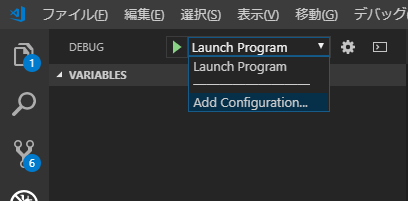
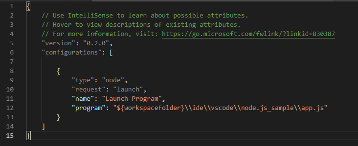

# node.js

## プログラムの実行方法
node.jsをインストールしておく  
VS Code標準でサポートしているので、ターミナルを開いて  
node app.js  
で実行できる。

## デバッグ方法
### デバッグ構成を設定する  
Ctrl + Shift + D でデバッグ画面に遷移  
Add Configurationを選択
  
すると、launch.jsファイルが作成される  
  
  
最後にF5でデバッグ開始！  
