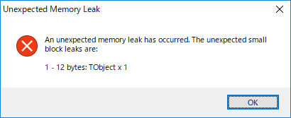

# TObject
System.TObject。delphiにおける最上位クラス。  
[embarcadero System.TObject](http://docwiki.embarcadero.com/Libraries/Rio/ja/System.TObject)  
よく使うのは、Create, Destroy, AfterConstruction, BeforeDestruction

## サンプルコード
※TObjectは抽象クラス。あくまでサンプルコード。
```pascal
procedure TFormTObject.AfterConstruction;
    begin
    inherited;
    p_Object := TObject.Create;
    Memo1.Lines.Add('UnitScope : ' + p_Object.UnitScope);
    Memo1.Lines.Add('UnitName : ' + p_Object.UnitName);
    Memo1.Lines.Add('ClassName : ' + p_Object.ClassName);
    Memo1.Lines.Add('ToSTring : ' + p_Object.ToString);
    end;

procedure TFormTObject.BeforeDestruction;
    begin
    FreeAndNil(p_Object);
    inherited;
    end;
```

## 関連
System.TClass： TObjectの抽象クラス  

## メモリリーク
FreeもしくはFreeAndNilでオブジェクトを開放すること。  
開放しない場合、メモリリークとなる。  
  