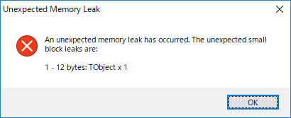

# メモリーリークを発見する方法

## メモリリークがあったかどうかを判定する
ReportMemoryLeaksOnShutdownをオンにする。  
プログラムのソースコードに追記する。
``` pascal
begin
  ReportMemoryLeaksOnShutdown := True;
  Application.Initialize;
  Application.MainFormOnTaskbar := True;
  Application.CreateForm(TForm1, Form1);
  Application.Run;
end.
```

アプリケーションが終了した際に、以下のようなダイアログが表示される。  

  
