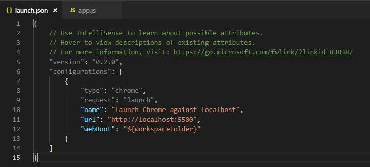
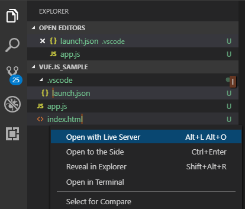

# VS Codeでvue.jsのデバッグ
  
## 調べてみた  
[jp.vuejs.org VS Codeによるデバッグ](https://jp.vuejs.org/v2/cookbook/debugging-in-vscode.html)  
cliというvue.jsのフレームワーク？的なものを使ってデバッグするらしい。  
しかし、今回はvue.jsが使えればいいので、素のjavascriptでデバッグする方法を探してみた。  
[Visual Studio Code でフロントエンドの開発環境を構築してデバッグする](https://qiita.com/C3REVE/items/273646ad028e98758e70)  
ここに書いてある拡張機能「LiveServer」でローカルサーバーを立ち上げればデバッグできそう。  

### 拡張機能  
[Debugger for Chrome](https://marketplace.visualstudio.com/items?itemName=msjsdiag.debugger-for-chrome)
[LiveServer](https://marketplace.visualstudio.com/items?itemName=ritwickdey.LiveServer)
  
### デバッグ手順
1. デバッグ構成を設定する。LiveServerのポート番号はhttp://localhost:5500だそうだ。  
  
2. サーバーを立ち上げる  

3. F9でデバッグ開始  