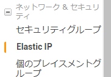
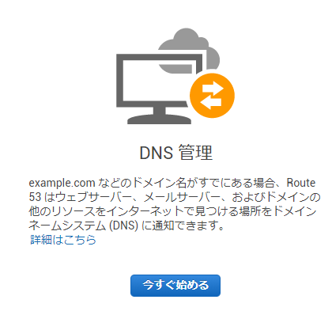
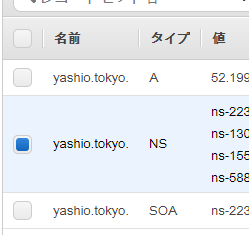

# ドメインを取得する
ほぼこの記事通り行いました。  
[お名前.comで取得したドメインをAmazon EC2に紐付ける](https://qiita.com/nadonado/items/a7c32c94fef87b7db0d5)  

## yashio.tokyoを取得するまで
八潮パークタウンのランニングマップ共有サイトを作りたい。  
まずはカタチから。ドメインを取得しました。  
ec2のインスタンスなので、awsで取得しようと思ったが値段高い。  
お名前.comで探したところ.tokyoドメインが141円/年と安かったので
yashio.tokyoドメインを取得。東京都品川区の八潮なので。  

## 手順
1. お名前.comでドメイン取得
    1. Whois代理公開しないと個人情報漏れちゃうっぽいので代理公開をした。別途300円。
    2. awsのほうの設定をしてから、NameServerを変更する。
2. ec2の設定
    1. ElasticIPを割り当てる  
      
    2. 割り当てたElasticIPにインスタンスのIDとPrivate IPを割り当てる（1つしか持っていないので選択肢は1つ）
3. Route53の設定
    1. ホストゾーンを作成  
      
    2. ホストゾーンにElasticIPを割り当てる
    3. ネームサーバーを4.でお名前.comに割り当て  
      
4. お名前.comの設定
    1. ネームサーバーを設定する
    